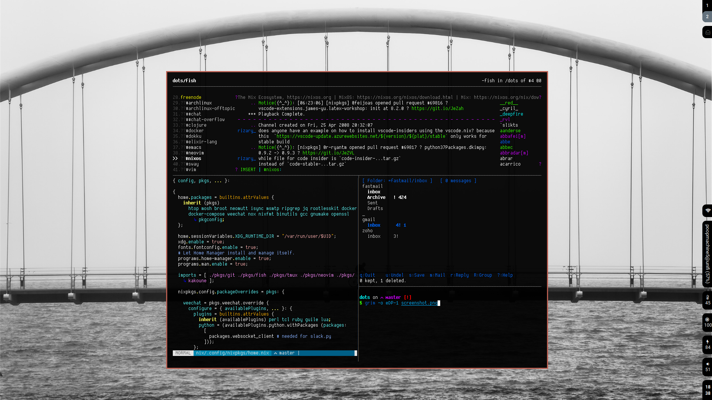

# meatcar's dot files

Supports Linux and WSL.

## Requirements

- Nix/NixOS

## Installation

- On NixOS `ln -rs configuration.nix /etc/nixos/configuration.nix`, or fiddle with `NIX_PATH`.

- Without NixOS:

    1. Symlink `home.nix` to `~/.config/nixpkgs/home.nix`.
    1. Install [Nix](https://nixos.org/nix/download.html)
    1. Install [Nixpkgs](https://nixos.org/nixpkgs/download.html)
    1. Install [Home Manager](https://github.com/rycee/home-manager)
    1. Run `stow nix`
    1. Run `home-manager switch`

- All the packages in `conf/` can be deployed with GNU Stow. `cd` into `conf`, and run `stow <package>`.

Enjoy!

## To update

```
niv update
sudo nixos-rebuild switch
# OR
home-manager switch
```

## What does it look like?

Given the right wallpaper, it can look like this!


